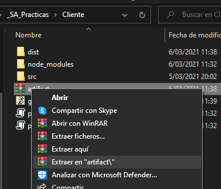
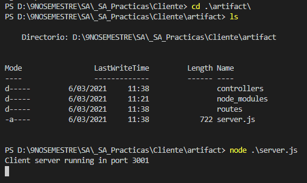
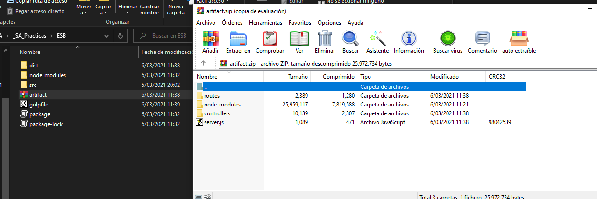

# _SA_Practicas

José Francisco Puac Ixcamparic
201700342

Repositorio de Prácticas Software Avanzado

# [SA] Documentación de Uso Práctica 5

## Artefacto

Para utilizar la práctica es necesario realizar los siguientes pasos:

- Tener instalado npm y nodejs.
- Dirigirse a la ubicación de las carpetas Cliente, Repartidor, Restaurante y EBS.


- Para todas las carpetas:
    - Ingresar a la carpeta
    - Descomprimir el archivo "artifact.js" de cada microservicio, para obtener los archivos necesarios para ejecutarlo.
    - Ejecutar el comando "node server.js" para levantar el microservicio en su puesto respectivo.






## Archivos para Funcionamiento del Artefacto

### GULPFILE.JS
Archivo utilizado para la creación del artefacto.


## CREACIÓN DEL ARTEFACTO

En cada carpeta del microservicio, ejecutar el comando "gulp" para generar el artefacto en la carpeta dist, y posteriormente comprimirlo en el archivo "artifact.zip"




## Funcionalidades del Software

Estas funcionalidades pueden ser testeadas a través de Postman.

### Ejecución de Artefactos


### Cliente
- Solicitar pedido al restaurante

```json
POST http://localhost:3000/esb/client/pedido
{
    "idCliente" : 2,
    "idProducto" : 2,
    "direccion" : "Ciudad de Guatemala",
    "precio" : 46,
    "cantidad" : 3
}

Respuesta:
{
    "status": true,
    "code": 200,
    "data": {
        "idCliente": 2,
        "producto": "Pollo",
        "direccion": "Ciudad de Guatemala",
        "precio": 46,
        "cantidad": 3
    },
    "msg": "Producto Solicitado exitosamente."
}
```

- Verificar estado del pedido al restaurante

```json
GET http://localhost:3000/esb/client/restaurante
{
    "idPedido" : 2
}
Respuesta:
{
    "status": true,
    "code": 200,
    "data": {
        "result": {
            "idPedido": 2,
            "idCliente": 1,
            "producto": "Refresco",
            "direccion": "Mixco",
            "precio": 23,
            "cantidad": 7,
            "estado": "Preparándose"
        }
    }
}
```

- Verificar estado del pedido al repartidor

```json
GET http://localhost:3000/esb/client/repartidor
{
    "idPedido" : 3
}
Respuesta:
{
    "status": true,
    "code": 200,
    "data": {
        "result": {
            "idPedido": 3,
            "idCliente": 5,
            "producto": "Pollo",
            "direccion": "Ciudad de Guatemala",
            "precio": 53,
            "cantidad": 1,
            "estado": "Entregado"
        }
    }
}
```

### Restaurante
- Recibir pedido del cliente

```json
GET http://localhost:3000/esb/restaurant/pedido
{
    "idPedido" : 1
}
Respuesta:
{
    "status": true,
    "code": 200,
    "data": {
        "result": {
            "idPedido": 1,
            "idCliente": 3,
            "producto": "Arroz",
            "direccion": "Ciudad de Guatemala",
            "precio": 42,
            "cantidad": 4
        }
    },
    "msg": "Pedido Recibido a Restaurante Exitosamente."
}
```

- Informar estado del pedido al cliente

```json
POST http://localhost:3000/esb/restaurant/cliente
{
    "idPedido" : 2
}
Respuesta:
{
    "status": true,
    "code": 200,
    "estado": "Preparándose",
    "idPedido": 2
}
```

- Avisar al repartidor que ya está listo el pedido

```json
POST http://localhost:3000/esb/restaurant/listo
{
    "idPedido" : 3
}
Respuesta:
{
    "status": true,
    "code": 200,
    "estado": "Listo",
    "idPedido": 3,
    "msg": "Pedido Listo para el Repartidor."
}
```

### Repartidor
- Recibir pedido del restaurante

```json
GET http://localhost:3000/esb/deliver/pedido
{
    "idPedido" : 1
}
Respuesta:
{
    "status": true,
    "code": 200,
    "data": {
        "result": {
            "idPedido": 1,
            "idCliente": 3,
            "producto": "Arroz",
            "direccion": "Ciudad de Guatemala",
            "precio": 42,
            "cantidad": 4
        }
    },
    "msg": "Pedido Recibido a Repartidor Exitosamente."
}
```

- Informar estado del pedido al cliente

```json
POST http://localhost:3000/esb/deliver/cliente
{
    "idPedido" : 2
}
Respuesta:
{
    "status": true,
    "code": 200,
    "estado": "En Camino",
    "idPedido": 2
}
```

-  Marcar como entregado

```json
POST http://localhost:3000/esb/deliver/entregado
{
    "idPedido" : 2
}
Respuesta:
{
    "status": true,
    "code": 200,
    "estado": "Entregado",
    "idPedido": 2,
    "msg": "Pedido entregado al Cliente exitosamente."
}
```
