# [SA] Documentación de Uso Práctica 2

José Francisco Puac Ixcamparic
201700342

### Parte 1 (JWT)

Para utilizar la práctica es necesario realizar los siguientes pasos:

- Descargar Python 3.9 desde la página oficial. [Descargar Python](https://www.python.org/)
- Ingresar a su consola de preferencia (en este caso Visual Studio Code) y dirigirse a la ubicación del archivo "jwt.py".

- Descargar las librerías necesarias, en este caso son "base64 & json" (Puede que ya vengan instaladas por defecto)
- Ejecutar el archivo jwt.py. Esto se puede realizar utilizando el botón en VS Code en la esquina superior derecha, o bien ejecutando "python3 jwt.py"

## Funcionalidades del Software

- Menú
1. Seleccionar la opción a realizar. Existen 2 opciones: Crear JWT y Validar JWT.

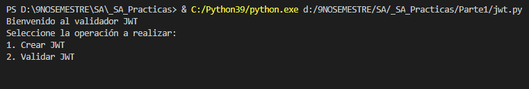

- Crear JWT
1. Seleccionar la opción (1).
2. Ingresar carnet.
3. Ingresar Nombre.
4. El programa crea un secret especial en base al carnet ingresado, lo asocia al mismo en memoria y se visualiza el JWT generado.

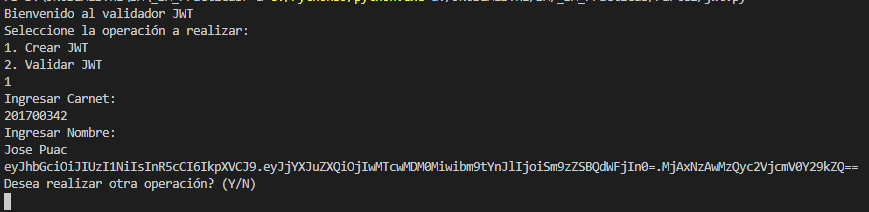

- Validar JWT
1. Seleccionar la opción (2).
2. Ingresar JWT
3. Si el JWT fue creado por el programa previamente, este lo desencriptará recibiendo el payload y en base al carnet desencriptado, buscar el secret almacenado en memoria, si existe generará un token provisional y lo compara con el ingresado, si coinciden se mostrará el mensaje "TOKEN VÁLIDO", en caso contrario, aparecerá el mensaje "TOKEN NO VÁLIDO"

Token Válido:

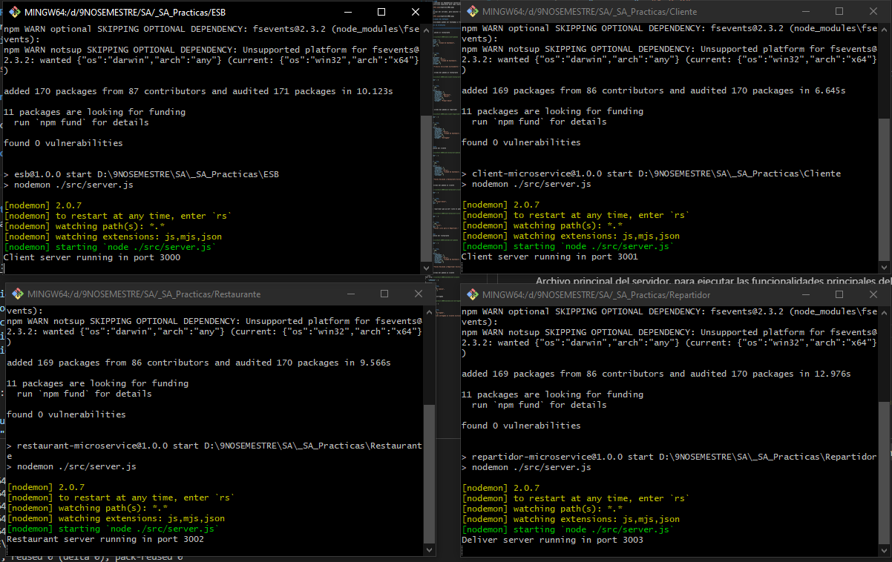

Token No Válido:

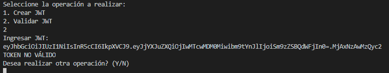

Tras finalizar cualquier operación, el programa pregunta si se quiere realizar una nueva operación o salir del sistema:

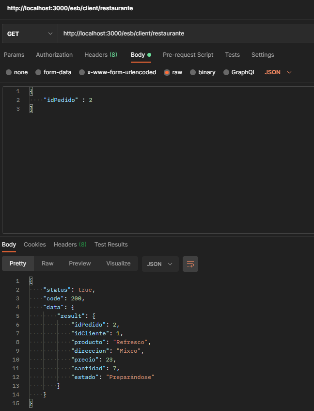

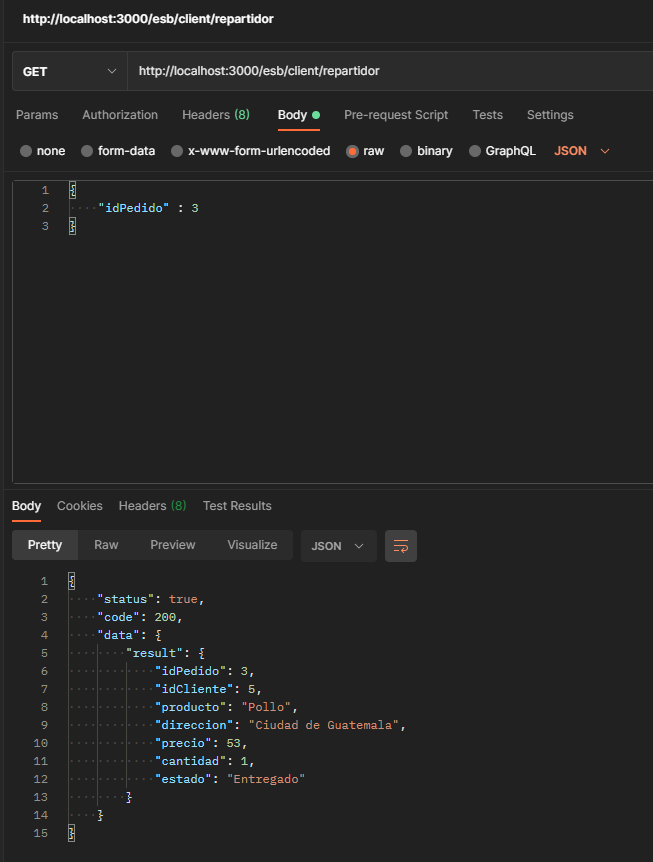

### Parte 2 (SOAP REQUESTS)

Para utilizar la práctica es necesario realizar los siguientes pasos:

- Descargar Python 3.9 desde la página oficial. [Descargar Python](https://www.python.org/)
- Ingresar a su consola de preferencia (en este caso Visual Studio Code) y dirigirse a la ubicación del archivo "calc.py".

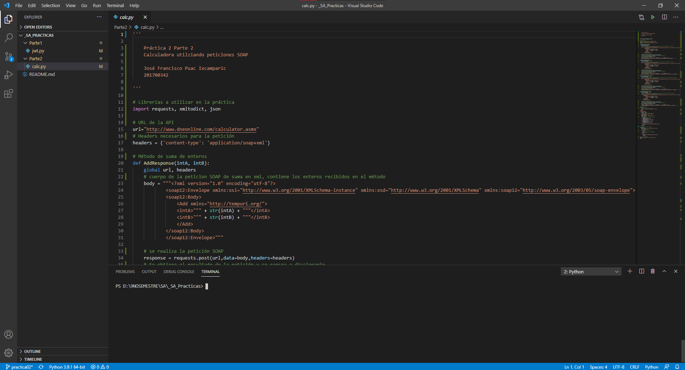

- Descargar las librerías necesarias, en este caso son "requests, xmltodict & json" (Puede que ya vengan instaladas por defecto)
- Ejecutar el archivo jwt.py. Esto se puede realizar utilizando el botón en VS Code en la esquina superior derecha, o bien ejecutando "python3 calc.py"

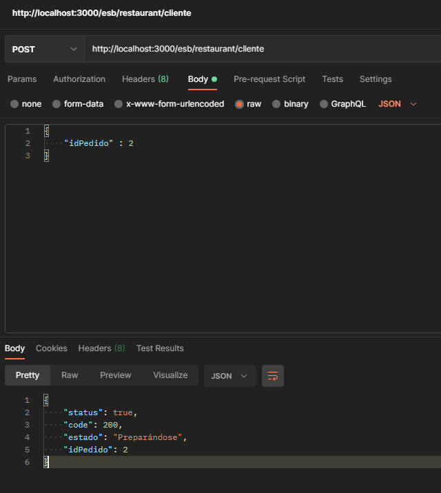

## Funcionalidades del Software

- Menú
1. Seleccionar la opción a realizar. Existen 4 opciones: Sumar, Restar, Multiplicar y Dividir.

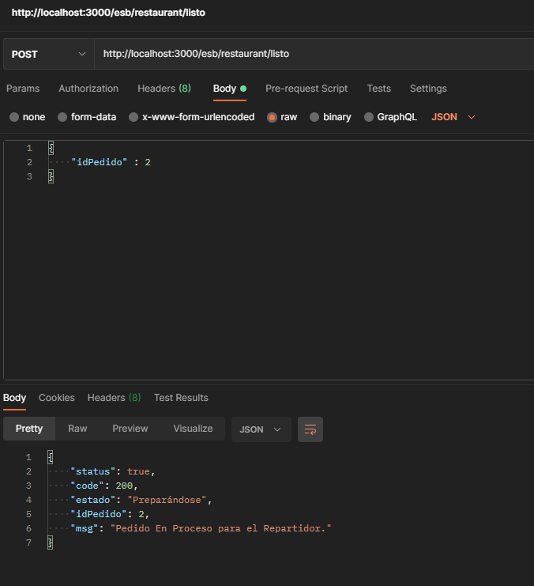

- Suma
1. Seleccionar la opción (1).
2. Ingresar los números enteros a sumar.
3. El programa te visualiza el resultado de la suma.

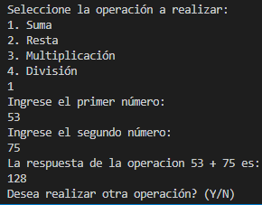

- Resta
1. Seleccionar la opción (2).
2. Ingresar los números enteros a restar.
3. El programa te visualiza el resultado de la resta.

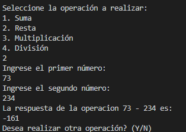

- Multiplicación
1. Seleccionar la opción (3).
2. Ingresar los números enteros a multiplicar.
3. El programa te visualiza el resultado de la multiplicación.

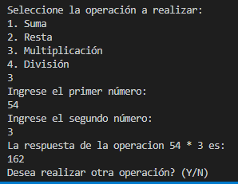

- División
1. Seleccionar la opción (4).
2. Ingresar los números enteros a dividir.
3. El programa te visualiza el resultado de la división. Si la división resulta en un número decimal, lo trunca.

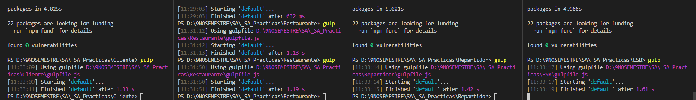

Tras finalizar cualquier operación, el programa pregunta si se quiere realizar una nueva operación o salir del sistema:

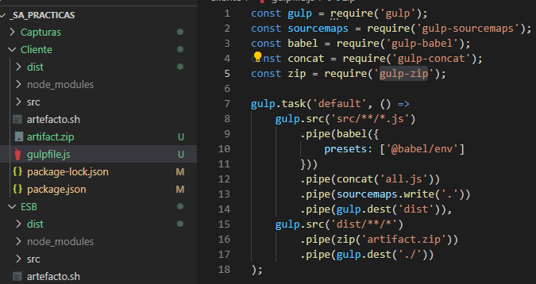

