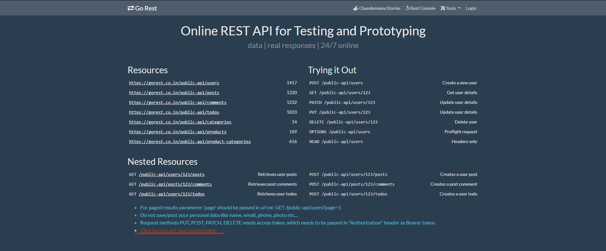

# _SA_Practicas

José Francisco Puac Ixcamparic
201700342

Repositorio de Prácticas Software Avanzado

## [SA] Documentación de Uso

### Registro Almacenado en la API como validación

*1611*

Para utilizar la práctica es necesario realizar los siguientes pasos:

- Ir a la carpeta donde se encuentran los archivos y abrir el archivo "index.js" para editar.

- Dirigirse a la página "[https://gorest.co.in/](https://gorest.co.in/)" y generar un nuevo token de autenticación para consumir su API.

- Ingresare el token brindado por la API en la línea 13 del archivo "index.js" en la variable "token".

- Abrir el archivo "index.html" en su navegador de preferencia. Se despliega una interfaz simple para poder utilizar el programa.

## Funcionalidades del Software

- CREAR REGISTRO EN LA API
1. Llenar los campos del formulario "Datos", tales como el nombre del registro, indicando si es hombre o mujer ("Male Or Female") y el correo del registro.
2. Seleccionar la opción "Registrar Persona"

Si el registro resulta exitoso, se visualizará la siguiente alerta:

- LISTAR ULTIMO REGISTRO CREADO EN EL PROGRAMA

*Para realizar esta operación se debe de haber creado previamente un registro en el programa.

1. Se debe de seleccionar la opción "Obtener Registro Creado"
2. Se visualiza el último registro creado anteriormente.

En los datos se indican el nombre del registro, el género, el correo, la fecha de creación, y la última fecha de modificación.

- MODIFICAR ULTIMO REGISTRO CREADO EN EL PROGRAMA

*Para realizar esta operación se debe de haber creado previamente un registro en el programa.

1. Llenar los campos que se requieran modificar del formulario "Datos a Modificar", como el nombre del registro, indicando si es hombre o mujer ("Male Or Female") o el correo del registro.
2. Seleccionar la opción "Modificar Registro".

Si el registro se modifica exitosamente, se visualizará la siguiente alerta:

Se puede verificar esta actualización utilizando la funcionalidad de listar el registro.

- ELIMINAR ULTIMO REGISTRO CREADO EN EL PROGRAMA DE LA API

*Para realizar esta operación se debe de haber creado previamente un registro en el programa.

1. Se debe de seleccionar la opción "Último registro Creado"
2. Si el registro se elimina correctamente, se visualiza una alerta indicando el éxito de la operación.

Se puede verificar esta eliminación utilizando la funcionalidad de listar el registro, mostrando un error al intentar listar el registro.

# Para visualizar mi registro en el programa:

Obtener último registro sin haber creado ninguno previamente.